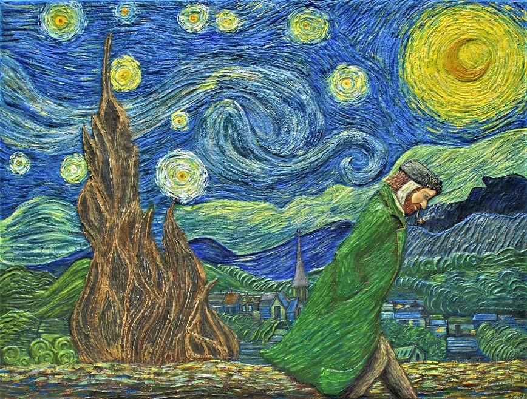

Basic Markdown Grammar
===
## 1. Header

    # This is a H1
    ## This is a H2
    ### This is a H3
    #### This is a H4
    ##### This is a H5
    ###### This is a H6

**above code will be converted as below**


# This is a H1
## This is a H2
### This is a H3
#### This is a H4
##### This is a H5
###### This is a H6

## 2. code block
### 2.1 indent
indent makes code block.
```
    this is indented sentence
    this is indented sentence 2
    this is indented sentence 3
```
above code will be converted as below.  

    this is indented sentence
    this is indented sentence 2
    this is indented sentence 3

<!--
### 2.2 code block ver2

    ``` makes code block

``` ```


    ```
    this will be in code block 1  
    this will be in code block 2  
    this will be in code block 3  
    ```


above code will be converted as below.  

``` 
this will be in code block 1  
this will be in code block 2  
this will be in code block 3 
```
-->
## 3. lines
    * * *
    ***
    *****
    - - -
    -----------------------------

above code will be converted as below lines.

* * *
***
*****
- - -
-----------------------------

## 4. emphasis

    *single asterisks*
    _single underscores_  

    **double asterisks**
    __double underscores__  

    ++underline++
    ~~cancelline~~
    
  

```
above code will be converted as below
```

*single asterisks*
_single underscores_  

**double asterisks**
__double underscores__  

++underline++
~~cancelline~~


## 5. Image

    
    

    </img>
    </img>

above code will be converted as below


</img>


</img>